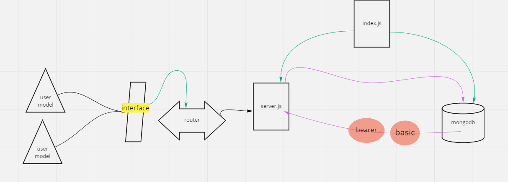

# bearer-auth

*Auther: Abeer Rafati*

**This app to explain how to creat a sign up and sign in by basic, bearer ,acl auth**   

[Produchion deployment](https://calss7awr.herokuapp.com/)    
[Pull req](https://github.com/AbeerAl-Rafati/bearer-auth)   

*To use this app:*
- clone this repo  
- `cd bearer_auth` 
- to download all dependencies used in this app, use in terminal 
> `npm i` 
- to run the server use in terminal  
> `nodemon` 

- to run test it use in termintl 
> `npm test`    

